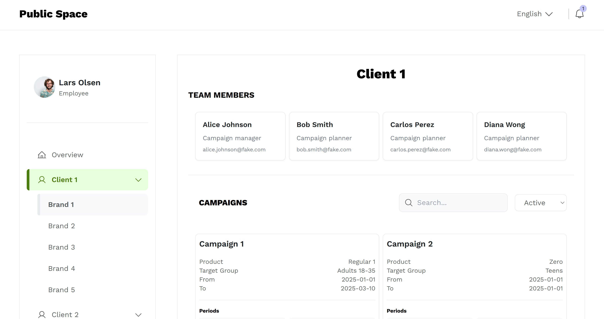

# Study Case | React, TypeScript, TailwindCSS & i18Next



This project is a prototype for a study case, where the goal is to visualize client campaign data and provide an intuitive user interface for employees (client leads and campaign planners) to navigate and manage campaign details. The system should allow users to interact with the data to get a breakdown of client information.

This prototype was designed and implemented within 3 days.

## Internationalization (i18Next)

This project includes a basic implementation of `i18Next` in the overview page to demonstrate how language translation can be integrated.
Given the limited timeframe for prototype development, a full implementation of i18Next on all pages was not included.

## Development Environment

To set up the development environment:

1. Ensure you have Node.js installed (> 20), the app has been tested with node `20.10.0`.
2. `npm install`
3. `npm run dev`
4. the browser should open automatically, if not, you could navigate to the suggested url <http://127.0.0.1:8080/>

## Build

To build the project for production, run:

```bash
npm run build
```

## Documentation

- [Repository](https://github.com/FP22FD/dashboard-public-space)
- [Hosted demo on Netlify](https://dashboard-public-space.netlify.app/)
- [Figma Prototype](https://www.figma.com/proto/b5rDIng0Ep68f8OuEcRbyG/7.Publicis-Norge-%7C-Case-study?page-id=20008%3A25268&node-id=20008-25269&p=f&viewport=298%2C44%2C0.38&t=9QGf6dzb4x69aIXq-1&scaling=min-zoom&content-scaling=fixed)
- [System Guide](https://www.figma.com/proto/b5rDIng0Ep68f8OuEcRbyG/7.Publicis-Norge-%7C-Case-study?page-id=9046%3A70050&node-id=16305-8771&p=f&viewport=327%2C71%2C0.13&t=KRYBuj4kn0msudAp-1&scaling=scale-down&content-scaling=fixed&starting-point-node-id=16305%3A8771)

## Case description

> For this case, you can consider users of the system to be employees.
> These people include client leads and campaign planners.
> A common need for both is to have control over clients campaigns throughout the media planning and buying process.

> We have provided a data set in data.json that can be loaded through api-client.ts.
> This contains a somewhat accurate representation of what belongs to each client (such as brands, campaigns, teams, and budgets).
> Your task is to load the data from api-client.ts and visualize it in a UI.
> Use the data to make the UI that you feel gives the best user experience.
> Your UI should include a way to navigate between clients and a breakdown of client information.

> TypeScript is recommended, but you can also use plain JavaScript.
> Use a framework of your choice, like Vue, React, Svelte or similar.

> If you have some time left you can add additional interactive functionality to your solution.

## Evaluation criteria

- User experience
- Visual design
- Code quality
- Interactivity

## Technologies Used

- React
- TypeScript
- TailwindCSS
- Vite
- i18next (for internationalization)
